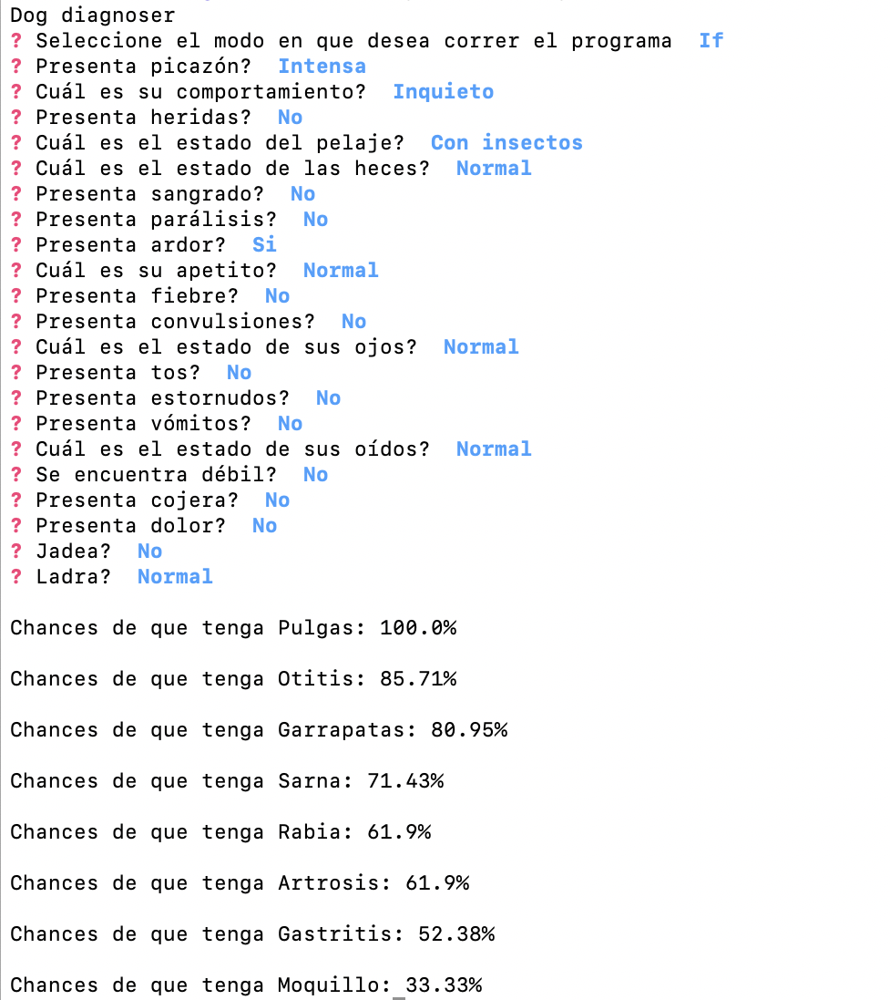

# RETE Algorithm

Simple RETE algorithm for FIUBA's 75.69 Fallas II

## Run

It's required to have Python 3 installed

* pip install -r requirements.txt
* python main.py

## Ejemplo de Uso

### RETE

Aquí presentamos un ejemplo de uso del sistema en modo RETE. 

### If

Aquí presentamos un ejemplo de uso del sistema en modo If. 

